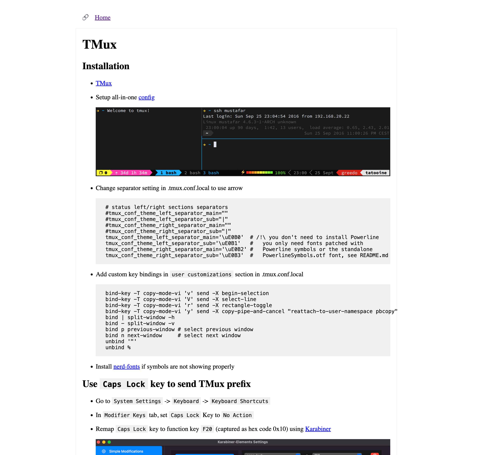

<h1 align="center">Proteus</h1>

[](https://goreportcard.com/report/github.com/iamjinlei/proteus)
[](https://www.gnu.org/licenses/gpl-3.0)
[](https://pkg.go.dev/github.com/iamjinlei/proteus)


## Why Another Static Site Generator?

Often times, I'd like to take notes and make them available on the web.
Markdown is an ideal choice for 3 reasons:
* Works with any text editor.
* Allows nice formatting with some custom tweaks.
* Free hosting on github pages.

Yet there are many mature markdown to static site generators.
I tried and steped back from those choices because:
* They are general-purpose site creation tools.
The default setting is not ideal for simple note taking (e.g. lack of text highlighting, keyword index, etc.).
* Once you want to go beyond the default settting, there are a bunch of coding and setup required.
* Tweaks for one site generator may not work for another.

`Proteus` is dedicated for taking notes, with features making common tasks quick and easy.
There is no config for theme or customization required.
Take your time writing notes rather than code :)

## Setup

No setup is required.
Just clone the repo.
```
https://github.com/iamjinlei/proteus.git
```

## Run

Local run:

```
go run ./cmd/ -s [path to markdown root]
```

This converts and serves HTML requests directly from markdown source on demand.
This is good for editing and testing.

Generation:

```
go run ./cmd/ -s [path to source markdown root] -d [path to destination root] -g
```

## Feature Demo

Check out the [demo docs](https://iamjinlei.github.io/proteus/docs/) generated from example/docs

## Example Screenshot

* Instructions



* Book summary


